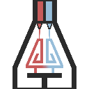

# PrintessFlow

**A precision slicer for 3D gel printing, pre-configured for the Printess Technologies Printessa Series.**

A customized build of [UltiMaker Cura](https://github.com/Ultimaker/Cura).

### [⬇ Download the latest release](https://github.com/PrintessTechnologies/PrintessFlow/releases/latest)

## Found a bug?

If you run into a bug or anything that does not behave the way you expect, please email
**[contact@printesstechnologies.com](mailto:contact@printesstechnologies.com)** so we can fix it.

It helps a great deal if you include the g-code that came out, the dispense tip profile you
were using, and what you expected to happen instead.

## License & attribution

PrintessFlow is based on [UltiMaker Cura](https://github.com/Ultimaker/Cura) (LGPLv3) and [CuraEngine](https://github.com/Ultimaker/CuraEngine) (AGPLv3). The full license texts are bundled with the installation.
